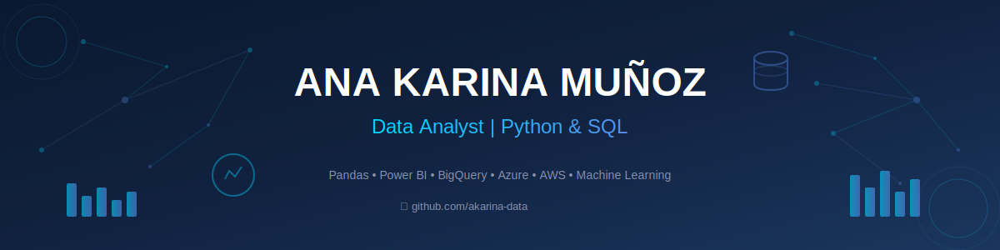

## 👋 ¡Hola! Soy Ana Karina

Ingeniera en Informática apasionada por el **análisis de datos** y la **automatización**. Me especializo en transformar datos en información útil para la toma de decisiones.

📍 Santiago, Chile

---

## 🛠️ Tecnologías

**Lenguajes**

**Análisis y Visualización**

**Bases de Datos**

**Cloud**

---
## 📂 Proyectos Destacados

| Proyecto | Descripción | Tecnologías |
|----------|-------------|-------------|
| [🌧️ Predicción de Lluvia](https://github.com/akarina-data/prediccion-lluvia-aus) | Modelo de ML para predicción meteorológica en Australia usando CRISP-DM | Python, scikit-learn, Pandas |
| 🏦 Análisis Bancario | KPIs de riesgo e inversiones | BigQuery, Looker Studio |
| 📊 Segmentación Clientes | Clustering con K-Means | Python, Pandas |

*Más proyectos en construcción* 🚧

---

## 📜 Certificaciones

- ✅ **Google Data Analytics Certificate** (2024)
- ✅ **Microsoft Azure Data Fundamentals DP-900** (2025)
- ✅ **Microsoft Azure AI Fundamentals AI-900** (2024)
- ✅ **Python Essentials - Cisco** (2024)
- ✅ **Data Science Industria Bancaria - X-Academy** (2024)

---

## 📫 Contacto

---
